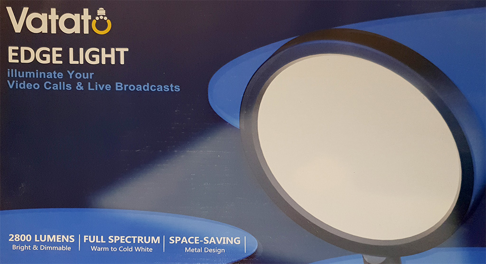

# Software remote control (mainly) for lamps using the HackRF
This is a software remote written in Python for controlling RF controllable lamps using the HackRF One. It's kind of an overkill using this kind of transceiver. But i already had it laying around... so it seemed like beeing the obvious hardware to me. Plus: the code is easy to modify for usage with other RF transmitters, since i couldn't figure out the transmission via *hackrf.dll* and therefore had to rely on using the *hackrf_transfer.exe* from the *HackRF-Tools* package. That's why i've included the [latest February build of the *HackRF-Tools* from 'Great Scott Gadgets'](https://github.com/greatscottgadgets/hackrf/releases/tag/v2024.02.1) in my repository.

##Features
This Python code creates a software representation of the remote for the Vatato Edge Light / M031 LED Desk Lamp:

