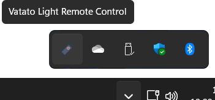
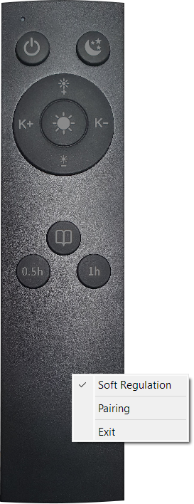

# Software remote control (mainly) for lamps using the HackRF
This is a software remote written in Python for controlling RF controllable lamps using the HackRF One. It's kind of an overkill using this transceiver. But i already had it laying around... so it seemed like beeing the obvious hardware to me. Plus: the code is easy to modify for usage with other RF transmitters, since i couldn't figure out the transmission via *hackrf.dll* and therefore had to rely on using the *hackrf_transfer.exe* from the *HackRF-Tools* package. That's why i've included the [latest February build of the *HackRF-Tools* from 'Great Scott Gadgets'](https://github.com/greatscottgadgets/hackrf/releases/tag/v2024.02.1) in my repository.

## Features
This Python code creates a software representation of the remote for the Vatato Edge Light / M031 LED Desk Lamp:

It has all the features of its hardware remote, including 'Pairing' the remote with a new lamp (which on the hardware remote is achieved by pressing the top two buttons simultaneously), 'Soft Regulation' (achievable on the hardware remote by pressing the dark/bright/cold/warm buttons for a longer time) and even a little status LED on the top left side.

## Usage
The *hackrf_transfer.exe*, *hackrf.dll* and *pthreadVC2.dll* are needed in the same directory as the Python script. By default the software remote starts minimized as a SysTray icon:

A double click on the icon maximizes the GUI for the remote. With a right click on the remote you'll get a context menu:

... where you can switch 'Soft Regulation' on/off (which is saved inside the *settings.ini* and remembered on the next start), pair the remote with a new lamp or close the software.

A double click onto the remote minimizes it back to a SysTray icon.

## Technical details
The Vatato Lamp expects a sine waveform with ASK modulation and an inverted bit sequence embedded into it, sent at 433Mhz. I tried different methods for sending the waveform without a command line tool, but couldn't get it to work. In the best case scenario it sent a couple of bytes... which lent me to believe, it could be a format problem. But since i couldn't figure it out, i approached another solution by using the *hackrf_transfer.exe* command line tool... which (on the bright side) makes the script easier to convert for other transmitters, while (on the not so bright side) adds a bit of a delay to the usage (which i tried to minimize as best as i can).

In the end: have fun with it!
